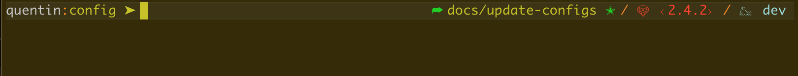

# My config files

Repository for my config files for MAC OS

### Screenview

## Git config

Base for global gitignore

NB: Don't forget to rename git files with "." at the beginning

`v-1.0`

- add gitconfig file

`v-1.1`

- add alias
- fix issue with pager

## Zsh config

This is the `.zshrc` custom config file

`v1.1`

- add some config as plugin, remove annoyind autocorrect zsh feature

`v1.2`

- sort function and alias
- add new alias

## ZSH Theme

This is a simple custom zsh theme for Docker and Rails

`v-1.1`

- add evaluate function to display the whale when `eval` a docker machine

`v-1.2`

- refacto and customize more this theme

`v-1.3`

- update layout